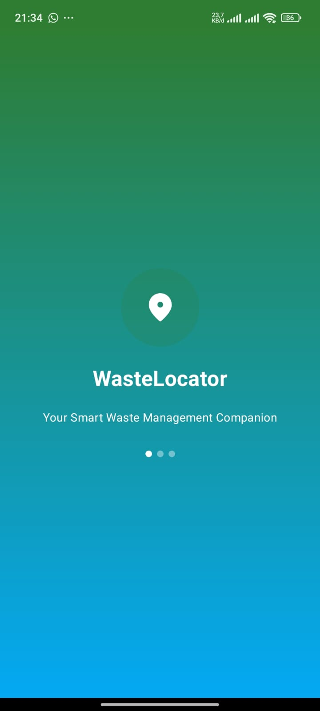
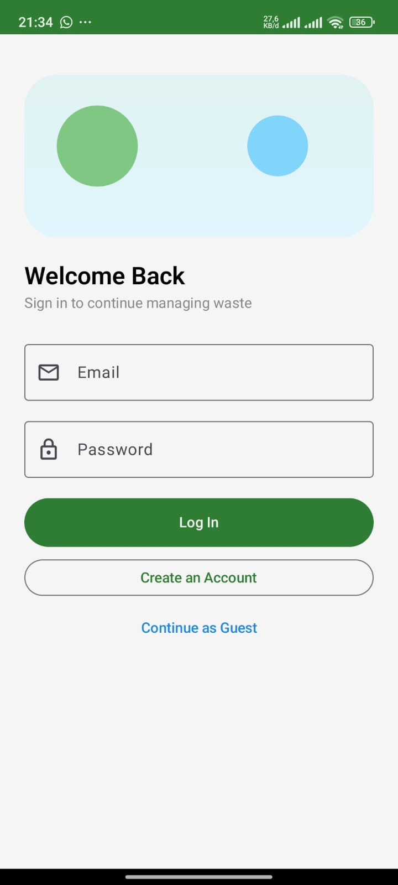
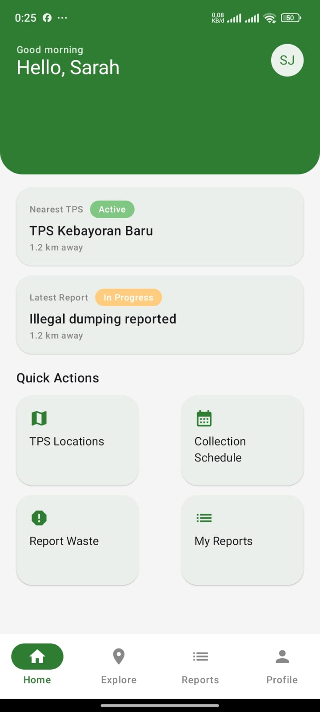
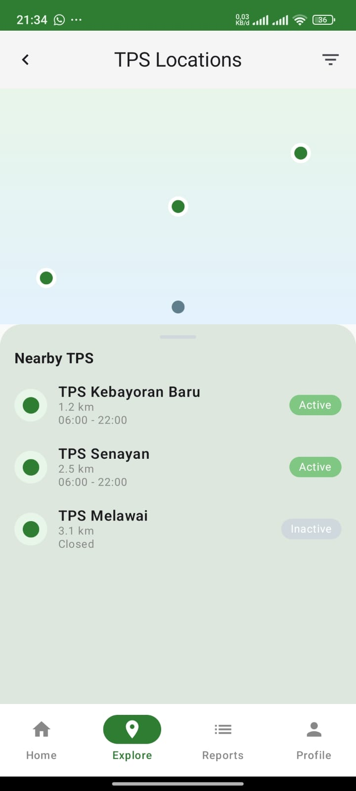
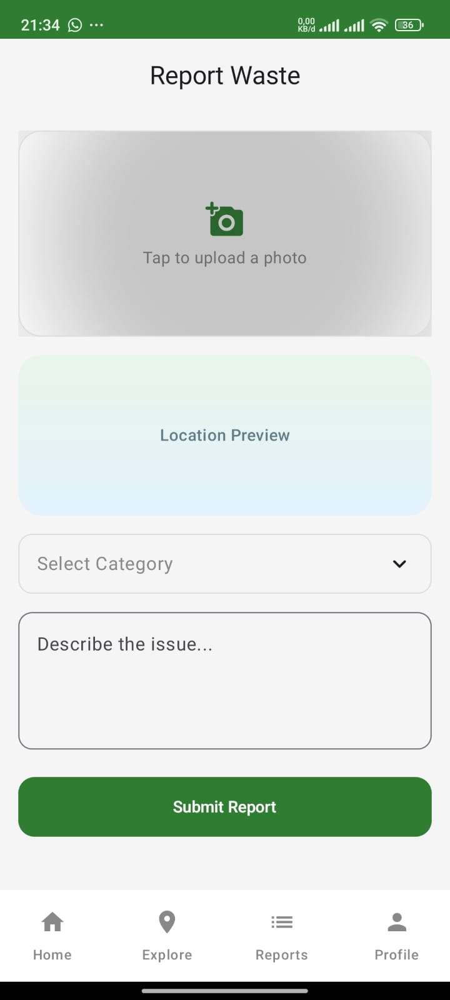
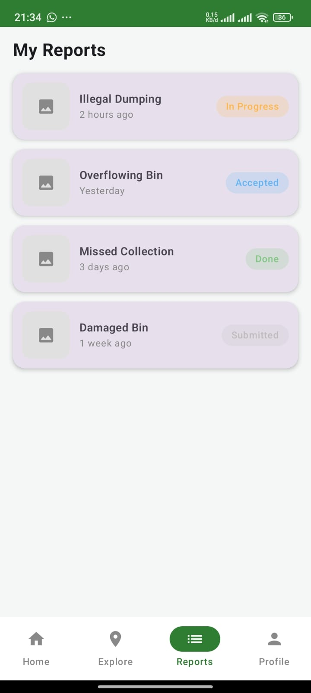
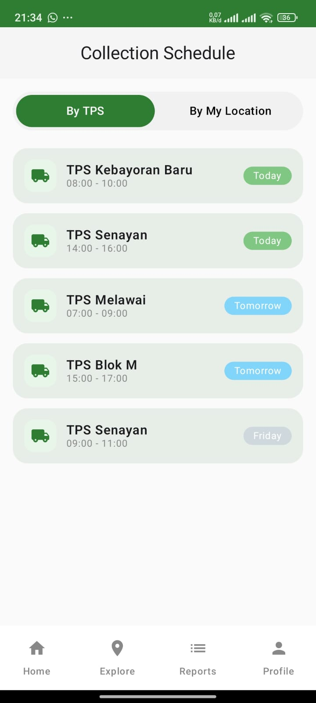
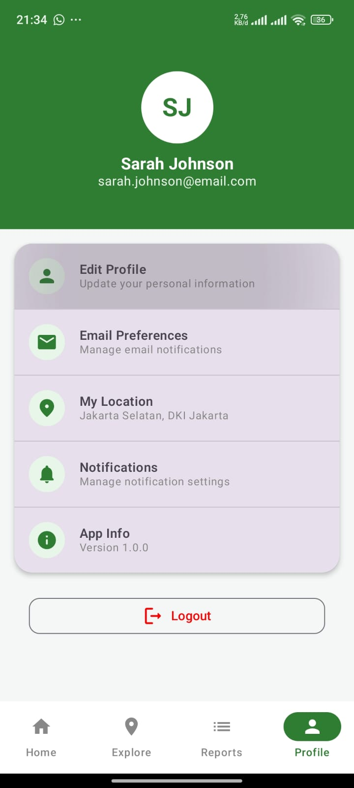

# 🗑️ Waste Locator App

Waste Locator adalah aplikasi Android berbasis **Jetpack Compose** yang membantu pengguna menemukan lokasi tempat pembuangan sampah terdekat, melaporkan titik sampah liar, serta memantau status laporan secara real-time. Aplikasi ini dirancang untuk meningkatkan kesadaran lingkungan dan mempercepat respons pengelolaan sampah di wilayah perkotaan.

---

## 🎯 Tujuan

* Mempermudah masyarakat menemukan TPS/TPA terdekat
* Menyediakan fitur pelaporan sampah liar berbasis lokasi
* Mendukung pengambilan keputusan berbasis data bagi pengelola kebersihan

---

## 🖼️ Screenshot Aplikasi

Berikut adalah tampilan utama aplikasi **Waste Locator**:

| Splash Screen                        | Login                         | Dashboard                         |
|--------------------------------------|-------------------------------|-----------------------------------|
|  |  |  |

| TPS Location                        | Report Waste                        | My Reports                        |
|-------------------------------------|-------------------------------------|-----------------------------------|
|  |  |  |

| Collection Schedule                        | Profile                         |
|--------------------------------------------|---------------------------------|
|  |  |

---

## ⚙️ Teknologi yang Digunakan

* **Kotlin**
* **Jetpack Compose**
* **Android SDK**
* **Google Maps API**
* **Material 3**

> *Belum menggunakan backend, database, atau authentication service*

---

## 🔧 Fitur Utama

* 📍 Pencarian lokasi TPS terdekat *(UI ready)*
* 📝 Form pelaporan sampah *(UI ready, belum terhubung backend)*
* 🗺️ Tampilan peta interaktif *(UI ready)*
* 👤 Profil pengguna *(planned)*
* 📊 Riwayat laporan *(planned)*

---

## 🔗 API & Backend Status

Saat ini aplikasi **belum terhubung dengan backend** (masih tahap frontend & UI flow). Seluruh data masih bersifat **dummy/static** sebagai bagian dari pemenuhan tugas kuliah.

> Backend (API/Firebase) direncanakan akan ditambahkan pada tahap pengembangan berikutnya.

---

## 🚀 Cara Menjalankan Project

1. Clone repository ini

```bash
git clone https://github.com/username/waste-locator.git
```

2. Buka di **Android Studio**
3. Sync Gradle
4. Jalankan di emulator / device

---

## 🗂️ Struktur Project (Ringkas)

```
app/
 ├─ data/
 ├─ ui/
 ├─ viewmodel/
 ├─ network/
 └─ utils/
```

---

## 👨‍💻 Developer

**Raflyansyah Ismail**
Mahasiswa Teknologi Informasi – UIN Antasari

---

## 📄 Lisensi

Project ini dibuat untuk keperluan pembelajaran dan pengembangan. Silakan gunakan dengan mencantumkan kredit.
